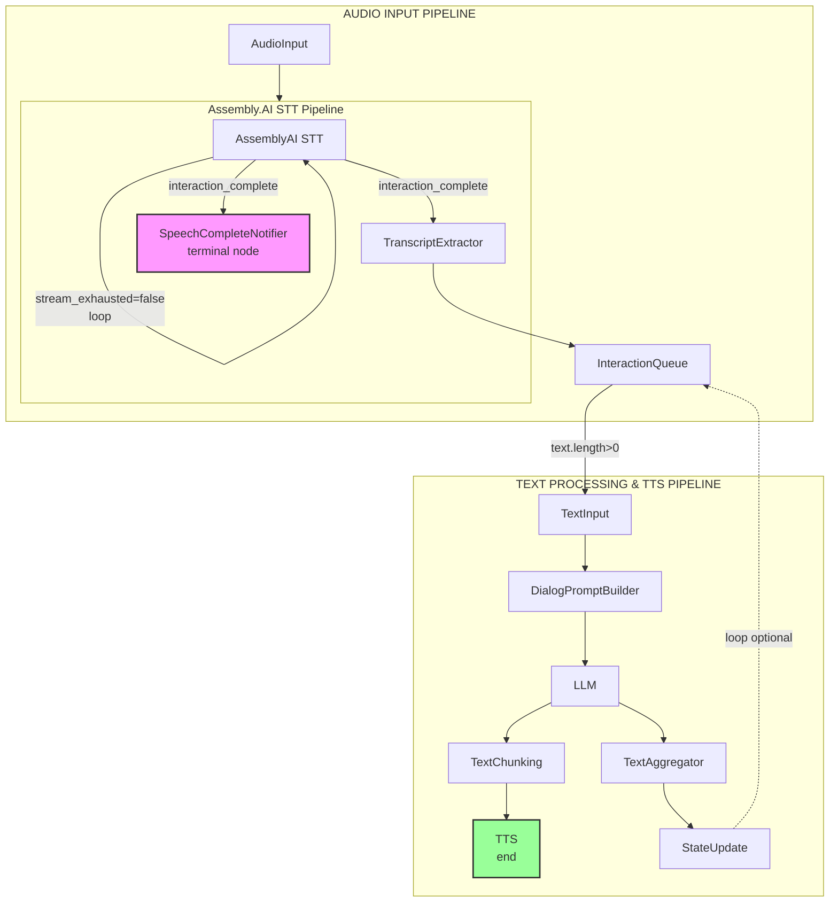

# Voice Agent Application

This README guides you through setting up and running the Voice Agent application, which demonstrates a simple chat interface with an AI agent that can respond to text and voice inputs.

## Prerequisites

- Node.js 18 or higher
- Assembly.AI API key (required for speech-to-text functionality)
- Inworld API key (required)

## Project Structure

The application consists of two main components:

- **server**: Handles communication with Inworld's LLM, STT, and TTS services through a sophisticated graph-based pipeline

- **client**: Provides a user interface for interacting with the AI agent

## Server Architecture

The voice agent server uses Inworld's Graph Framework with two main processing pipelines:

### Pipeline Overview



### STT Provider

The server uses **Assembly.AI** as the Speech-to-Text provider, which provides high accuracy with built-in speech segmentation.

## Setup

### Environment Variables

#### Server Environment Variables

Copy `server/.env-sample` to `server/.env` and fill all required variables. Some variables are optional and can be left empty. In this case default values will be used.

**Required Environment Variables:**
- `INWORLD_API_KEY` - Your Inworld API key (required)
- `ASSEMBLY_AI_API_KEY` - Your Assembly.AI API key (required for speech-to-text)

**Optional Environment Variables:**
- `VAD_MODEL_PATH` - Path to VAD model (defaults to packaged model)
- `LLM_MODEL_NAME` - LLM model name (defaults to `gpt-4o-mini`)
- `LLM_PROVIDER` - LLM provider (defaults to `openai`)
- `VOICE_ID` - Voice ID for TTS (defaults to `Dennis`)
- `TTS_MODEL_ID` - TTS model ID (defaults to `inworld-tts-1`)
- `GRAPH_VISUALIZATION_ENABLED` - Enable graph visualization (defaults to `false`)
- `DISABLE_AUTO_INTERRUPTION` - Disable auto-interruption (defaults to `false`)

#### Client Environment Variables (Optional)

The client supports optional environment variables to customize its behavior. Create a `.env` file in the `client` directory if you want to override defaults:

- `VITE_ENABLE_LATENCY_REPORTING` - Set to `true` to enable latency reporting in the UI (shows latency chart and latency badges on agent messages). Default: `false`
- `VITE_APP_PORT` - Server port to connect to. Default: `4000`
- `VITE_APP_LOAD_URL` - Custom load endpoint URL
- `VITE_APP_UNLOAD_URL` - Custom unload endpoint URL
- `VITE_APP_SESSION_URL` - Custom session WebSocket URL

### Install Dependencies and run the application

Install dependencies for both server and client:

```bash
# Install server dependencies
cd server
npm install

# Start the server
npm start
```

The server will start on port 4000.

```bash
# Install client dependencies
cd ../client
npm install
npm start
```

The client will start on port 3000 and should automatically open in your default browser. It's possible that port 3000 is already in use, so the next available port will be used.

## Using the Application

1. Configure the agent on the UI:

   - Enter your name.

   - Set the agent's name.

   - Provide a description for the agent.

   - Define the agent's motivation.

2. Click "Start" to begin the conversation.

3. Interact with the agent:

   - Type text in the input field and press Enter or click the send button.

   - Click the microphone icon to use voice input. You need to click the microphone icon again to stop the recording. Then you will receive a response from the agent.

   - Click the copy icon to copy the conversation to the clipboard.

## Troubleshooting

- If you encounter connection issues, ensure both server and client are running. Server should be running on port 4000 and client can be running on port 3000 or any other port.

- Don't forget to install the Inworld Runtime from the package or using link to local package for server application. Client application doesn't need to install the framework.

- Check that your API keys are valid and properly set in the `.env` file:
  - `INWORLD_API_KEY` - Required for Inworld services
  - `ASSEMBLY_AI_API_KEY` - Required for speech-to-text functionality

- For voice input issues, ensure your browser has microphone permissions.
