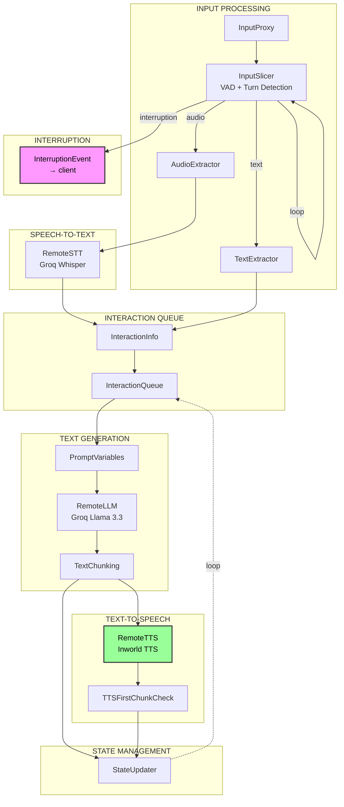

# Voice Agent Application

[](LICENSE)
[](https://inworld.ai/runtime)
[](https://docs.inworld.ai/docs/node/overview)
[](https://docs.inworld.ai/docs/models#llm)
[](https://voice-agent-client-dlvldu24na-uc.a.run.app)

This application demonstrates a simple chat interface with an AI agent that can respond to text and voice inputs, powered by Inworld AI Runtime.

## Prerequisites

- Node.js 20 or higher
- Inworld API key (required)

## Get Started

### Step 1: Clone the Repository

```bash
git clone https://github.com/inworld-ai/voice-agent-node
cd voice-agent-node
```

### Step 2: Configure Server Environment Variables

Copy `server/env.example` to `server/.env` and fill all required variables. Some variables are optional and can be left empty. In this case default values will be used.

Get your API key from the [Inworld Portal](https://platform.inworld.ai/).

### Step 3: Configure Client Environment Variables (Optional)

The client supports optional environment variables to customize its behavior. Create a `.env` file in the `client` directory if you want to override defaults:

- `VITE_ENABLE_LATENCY_REPORTING` - Set to `true` to enable latency reporting in the UI (shows latency chart and latency badges on agent messages). Default: `false`
- `VITE_APP_PORT` - Server port to connect to. Default: `4000`
- `VITE_APP_LOAD_URL` - Custom load endpoint URL
- `VITE_APP_UNLOAD_URL` - Custom unload endpoint URL
- `VITE_APP_SESSION_URL` - Custom session WebSocket URL

### Step 4: Install Dependencies and Run

Install dependencies for both server and client:

```bash
# Install server dependencies
cd server
npm install

# Start the server
npm start
```

The server will start on port 4000.

```bash
# Install client dependencies
cd ../client
npm install
npm start
```

The client will start on port 3000 and should automatically open in your default browser. It's possible that port 3000 is already in use, so the next available port will be used.

### Step 5: Configure and Use the Application

1. Define the agent settings:
   - Enter the agent system prompt
   - Click "Create Agent"

2. Interact with the agent:
   - For voice input, click the microphone icon to unmute yourself. Click again to mute yourself.
   - For text input, enter text in the input field and press Enter to send it to the agent

## Repo Structure

```
voice-agent-node/
├── server/                       # Backend handling Inworld's LLM, STT, and TTS services
│   ├── src/
│   │   ├── index.ts              # Server entry point with Express and WebSocket setup
│   │   ├── graph/
│   │   │   ├── graph_provider.ts # Graph provider interface definitions
│   │   │   ├── graph_runner.ts   # Graph execution and output handling
│   │   │   └── providers/
│   │   │       └── realtime_agent_provider.ts  # Realtime voice agent graph builder
│   │   ├── session/
│   │   │   ├── session_service.ts  # Session lifecycle management
│   │   │   └── session_store.ts    # In-memory session storage
│   │   └── stream/
│   │       └── multimodal_stream.ts  # Audio/text stream management
│   ├── models/
│   │   ├── silero_vad/
│   │   │   └── silero_vad_v6.0.onnx  # Voice Activity Detection model
│   │   └── pipecat_smart_turn/
│   │       └── smart-turn-v3.0.onnx  # Turn detection model
│   ├── env.example               # Environment variables template
│   ├── package.json
│   └── tsconfig.json
├── client/                       # Frontend React application
│   ├── src/
│   │   ├── app/
│   │   │   ├── chat/             # Chat UI components
│   │   │   ├── components/       # Shared layout components
│   │   │   ├── configuration/    # Agent configuration UI
│   │   │   ├── helpers/          # Utility functions
│   │   │   └── sound/            # Audio playback handling
│   │   ├── App.tsx
│   │   └── index.tsx
│   ├── public/
│   │   └── audio-processor.worklet.js  # Web Audio worklet for mic input
│   ├── package.json
│   └── vite.config.mts
├── contract/                     # Shared types for client-server communication
│   ├── index.ts
│   ├── session_api.ts
│   ├── ws_inbound.ts
│   └── ws_outbound.ts
├── constants.ts                  # Shared audio and model configuration
└── LICENSE
```

## Architecture

The voice agent server uses Inworld's Graph Framework to build a realtime voice agent pipeline with local VAD, remote STT/LLM/TTS processing.

### Pipeline Overview



### Key Components

| Component | Description |
|-----------|-------------|
| **Local VAD** | Silero VAD v6.0 for voice activity detection |
| **Turn Detector** | Pipecat Smart Turn v3.0 for detecting speech turn boundaries |
| **STT** | Inworld Remote STT with Groq Whisper Large v3 |
| **LLM** | Groq Llama 3.3 70B Versatile |
| **TTS** | Inworld TTS with configurable voice |

## Troubleshooting

- If you encounter connection issues, ensure both server and client are running. Server should be running on port 4000 and client can be running on port 3000 or any other port.
- Check that your API keys are valid and properly set in the `.env` file:
  - `INWORLD_API_KEY` - Required for Inworld services (STT, LLM, TTS)
- For voice input issues, ensure your browser has microphone permissions.

**Bug Reports**: [GitHub Issues](https://github.com/inworld-ai/voice-agent-node/issues)

**General Questions**: For general inquiries and support, please email us at support@inworld.ai

## Contributing

1. Fork the repository
2. Create a feature branch: `git checkout -b feature/amazing-feature`
3. Commit changes: `git commit -m 'Add amazing feature'`
4. Push to branch: `git push origin feature/amazing-feature`
5. Open a Pull Request

## License

This project is licensed under the MIT License - see the [LICENSE](LICENSE) file for details.
