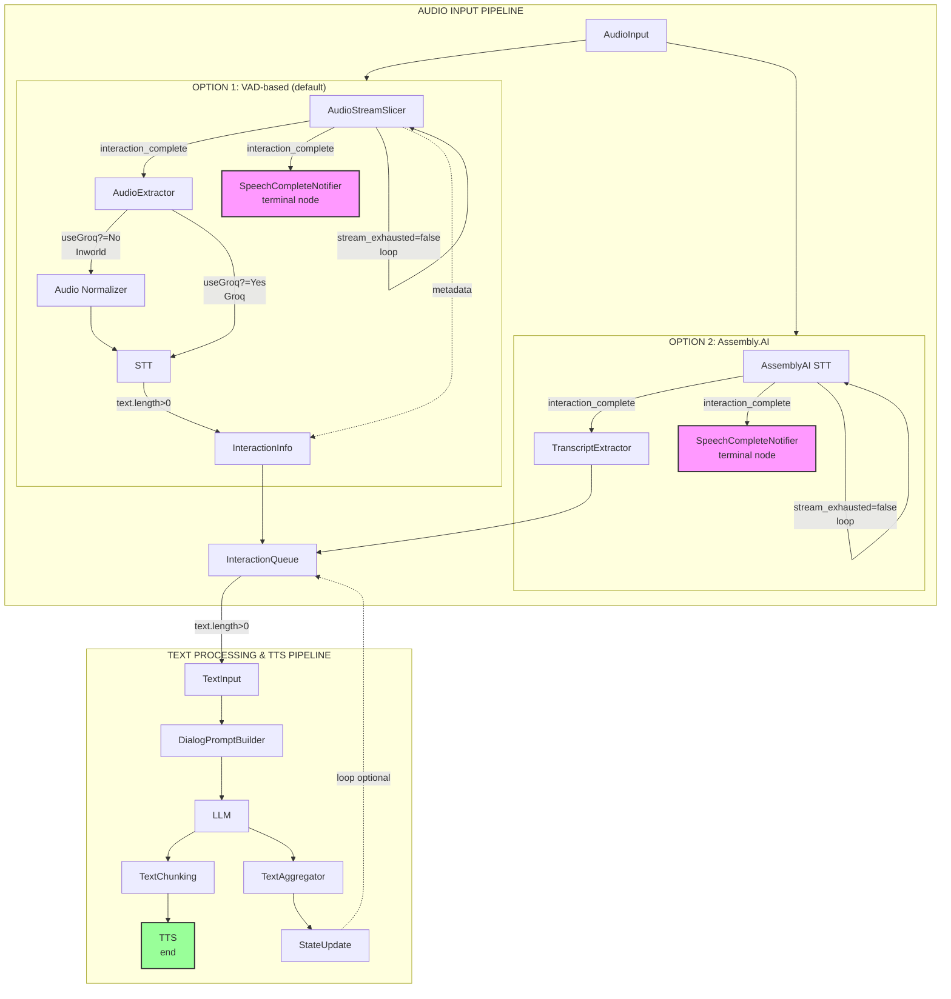

# Voice Agent Application

This application demonstrates a simple chat interface with an AI agent that can respond to text and voice inputs, powered by Inworld AI Runtime.

## Prerequisites

- Node.js (v18 or higher)
- An Inworld AI account and API key

## Get Started

### Step 1: Clone the Repository

```bash
git clone https://github.com/inworld-ai/voice-agent-node
cd voice-agent-node
```

### Step 2: Configure Server Environment Variables

Copy `server/.env-sample` to `server/.env` and fill all required variables. Some variables are optional and can be left empty. In this case default values will be used.

Get your API key from the [Inworld Portal](https://platform.inworld.ai/).

### Step 3: Configure Client Environment Variables (Optional)

The client supports optional environment variables to customize its behavior. Create a `.env` file in the `client` directory if you want to override defaults:

- `VITE_ENABLE_LATENCY_REPORTING` - Set to `true` to enable latency reporting in the UI (shows latency chart and latency badges on agent messages). Default: `false`
- `VITE_APP_PORT` - Server port to connect to. Default: `4000`
- `VITE_APP_LOAD_URL` - Custom load endpoint URL
- `VITE_APP_UNLOAD_URL` - Custom unload endpoint URL
- `VITE_APP_SESSION_URL` - Custom session WebSocket URL

### Step 4: Install Dependencies and Run

Install dependencies for both server and client:

```bash
# Install server dependencies
cd server
yarn install

# Start the server
yarn start
```

The server will start on port 4000.

```bash
# Install client dependencies
cd ../client
yarn install
yarn start
```

The client will start on port 3000 and should automatically open in your default browser. It's possible that port 3000 is already in use, so the next available port will be used.

### Step 5: Configure and Use the Application

1. Configure the agent on the UI:
   - Enter your name
   - Set the agent's name
   - Provide a description for the agent
   - Define the agent's motivation

2. Click "Start" to begin the conversation

3. Interact with the agent:
   - Type text in the input field and press Enter or click the send button
   - Click the microphone icon to use voice input. Click the microphone icon again to stop the recording. Then you will receive a response from the agent
   - Click the copy icon to copy the conversation to the clipboard

## Repo Structure

The application consists of two main components:

- **server** - Handles communication with Inworld's LLM, STT, and TTS services through a sophisticated graph-based pipeline
- **client** - Provides a user interface for interacting with the AI agent

## Architecture

The voice agent server uses Inworld's Graph Framework with two main processing pipelines:

### Pipeline Overview



### STT Provider Options

The server supports three Speech-to-Text providers:

- **Inworld Remote STT** (default) - Uses audio normalization for optimal quality
- **Groq Whisper** - Fast and cost-effective, skips normalization
- **Assembly.AI** - High accuracy with built-in speech segmentation

## Troubleshooting

- If you encounter connection issues, ensure both server and client are running. Server should be running on port 4000 and client can be running on port 3000 or any other port.

- Check that your API key is valid and properly set in the .env file.

- For voice input issues, ensure your browser has microphone permissions.

**Bug Reports**: [GitHub Issues](https://github.com/inworld-ai/voice-agent-node/issues)

**General Questions**: For general inquiries and support, please email us at support@inworld.ai

## Contributing

1. Fork the repository
2. Create a feature branch: `git checkout -b feature/amazing-feature`
3. Commit changes: `git commit -m 'Add amazing feature'`
4. Push to branch: `git push origin feature/amazing-feature`
5. Open a Pull Request

## License

This project is licensed under the MIT License - see the [LICENSE](LICENSE) file for details.
