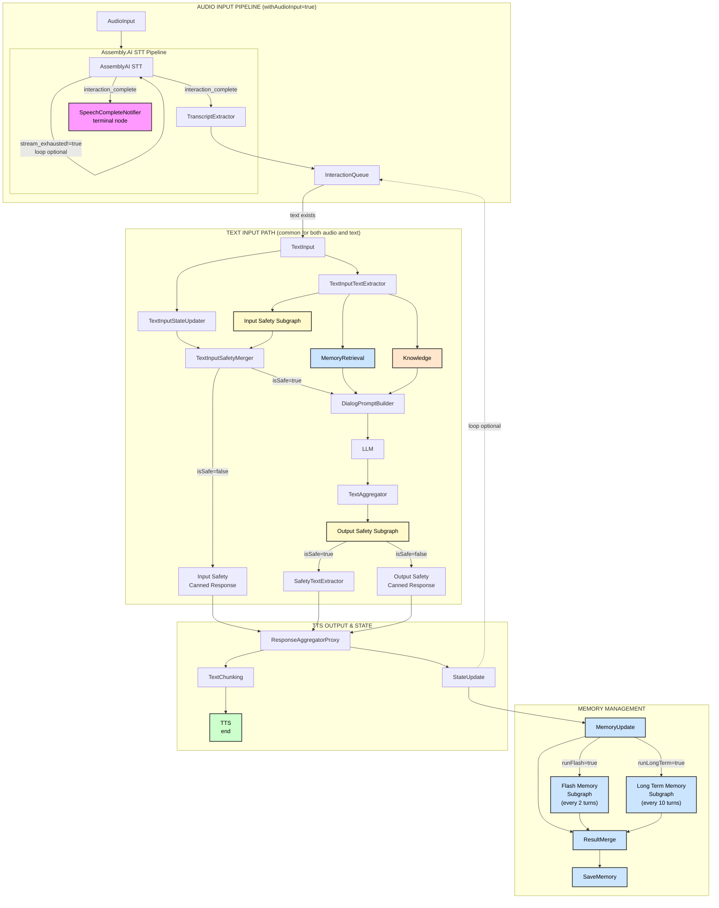

# Voice Agent Application

[](LICENSE)
[](https://inworld.ai/runtime)
[](https://docs.inworld.ai/docs/node/overview)
[](https://docs.inworld.ai/docs/models#llm)
[](https://voice-agent-client-dlvldu24na-uc.a.run.app)

This application demonstrates a simple chat interface with an AI agent that can respond to text and voice inputs, powered by Inworld AI Runtime.

## Prerequisites

- Node.js 20 or higher
- Assembly.AI API key (required for speech-to-text functionality)
- Inworld API key (required)

## Get Started

### Step 1: Clone the Repository

```bash
git clone https://github.com/inworld-ai/voice-agent-node
cd voice-agent-node
```

### Step 2: Configure Server Environment Variables

Copy `server/.env-sample` to `server/.env` and fill all required variables. Some variables are optional and can be left empty. In this case default values will be used.

**Required API Keys:**

1. **Inworld API Key**: Get your API key from the [Inworld Portal](https://platform.inworld.ai/).

2. **Assembly.AI API Key**: Required for speech-to-text functionality.
   - Create an account at [Assembly.AI](https://www.assemblyai.com/)
   - Get your API key from the [Assembly.AI Dashboard](https://www.assemblyai.com/app/account)
   - Set `ASSEMBLY_AI_API_KEY` in your `server/.env` file

**About Assembly.AI STT:**

Assembly.AI provides high-quality speech-to-text with:
- **High Accuracy**: Advanced AI models for accurate transcription
- **Real-time Streaming**: Low-latency streaming transcription for live conversations
- **Built-in Speech Segmentation**: Automatic detection of speech boundaries and pauses
- **Punctuation and Formatting**: Automatic punctuation and capitalization

The system processes audio streams in real-time, providing partial transcripts as speech is detected and final transcripts when speech segments are complete. Voice Activity Detection (VAD) identifies when users are speaking and automatically segments the audio stream.

### Step 3: Configure Client Environment Variables (Optional)

The client supports optional environment variables to customize its behavior. Create a `.env` file in the `client` directory if you want to override defaults:

- `VITE_ENABLE_LATENCY_REPORTING` - Set to `true` to enable latency reporting in the UI (shows latency chart and latency badges on agent messages). Default: `false`
- `VITE_APP_PORT` - Server port to connect to. Default: `4000`
- `VITE_APP_LOAD_URL` - Custom load endpoint URL
- `VITE_APP_UNLOAD_URL` - Custom unload endpoint URL
- `VITE_APP_SESSION_URL` - Custom session WebSocket URL

### Step 4: Install Dependencies and Run

Install dependencies for both server and client:

```bash
# Install server dependencies
cd server
npm install

# Start the server
npm start
```

The server will start on port 4000.

```bash
# Install client dependencies
cd ../client
npm install
npm start
```

The client will start on port 3000 and should automatically open in your default browser. It's possible that port 3000 is already in use, so the next available port will be used.

### Step 5: Configure and Use the Application

1. Define the agent settings:
   - Enter the agent system prompt or select one of the predefined characters
   - Click "Create Agent"

2. Interact with the agent:
   - For voice input, click the microphone icon to unmute yourself. Click again to mute yourself.
   - For text input, enter text in the input field and press Enter to send it to the agent

## Knowledge

The voice agent supports a knowledge system that allows you to provide domain-specific information to the agent. When enabled, the agent can retrieve relevant knowledge records based on the user's input to provide more accurate and contextual responses.

### How It Works

1. **Knowledge Storage**: Knowledge records are stored in `server/config/knowledge.json` as an array of strings
2. **Retrieval**: When a user message passes safety checks, the system retrieves the most relevant knowledge records using semantic similarity
3. **Context Injection**: Retrieved knowledge is included in the dialog prompt, giving the LLM access to relevant information

### Configuration

1. **Create Knowledge File**: Create or edit `server/config/knowledge.json`:
   ```json
   [
     "Your first knowledge record here",
     "Another knowledge record",
     "More domain-specific information"
   ]
   ```

2. **Environment Variables** (optional):
   - `KNOWLEDGE_PATH` - Custom path to knowledge.json file (default: `server/config/knowledge.json`)

3. **Automatic Enablement**: Knowledge retrieval is automatically enabled when `knowledge.json` contains valid records

### Best Practices

- Keep knowledge records concise and focused
- Each record should be self-contained and informative
- Use clear, descriptive language
- Organize related information into separate records
- Update knowledge records as your domain evolves

## Memory

The voice agent includes a sophisticated memory system that allows the agent to remember and learn from past conversations. The memory system consists of two types of memories:

### Flash Memory

**Purpose**: Captures important facts and details from recent conversations

**Characteristics**:
- **Frequency**: Updated every 2 turns (configurable via `FLASH_MEMORY_INTERVAL`)
- **Scope**: Processes the last 10 dialogue turns
- **Content**: Extracts notable facts, preferences, plans, relationships, and key events
- **Storage**: Stored with embeddings for semantic search
- **Retrieval**: Automatically retrieved when relevant to user queries

**Configuration**:
- `FLASH_MEMORY_INTERVAL` - Number of turns between flash memory updates (default: 2)
- `MEMORY_SIMILARITY_THRESHOLD` - Similarity threshold for memory retrieval (default: 0.3)
- `MAX_RETURNED_MEMORIES` - Maximum number of memories to return (default: 3)

### Long-Term Memory

**Purpose**: Creates high-level summaries of conversations over time

**Characteristics**:
- **Frequency**: Updated every 10 turns (configurable via `LONG_TERM_MEMORY_INTERVAL`)
- **Scope**: Processes the last 10 dialogue turns
- **Content**: Generates conversation summaries and key themes
- **Storage**: Stored with embeddings for semantic search
- **Retrieval**: Automatically retrieved when relevant to user queries

**Configuration**:
- `LONG_TERM_MEMORY_INTERVAL` - Number of turns between long-term memory updates (default: 10)
### Memory Storage

Memories are stored per session in JSON files. By default, memory files are stored in the system's temporary directory (`/tmp/voice-agent-memory/` on Unix systems). Each session has its own memory file named `{sessionId}.json`.

**Configuration**:
- `MEMORY_STORAGE_DIR` - Custom directory for memory storage (default: system temp directory)
- `RESULT_MERGE_SIMILARITY_THRESHOLD` - Threshold for deduplicating similar memories (default: 0.9)
- `RESULT_MERGE_MAX_FLASH_MEMORIES` - Maximum flash memories to keep (default: 200)
- `RESULT_MERGE_MAX_LONG_TERM_MEMORIES` - Maximum long-term memories to keep (default: 200)

### Memory LLM Configuration

You can configure separate LLM models for memory processing:

- `MEMORY_LLM_PROVIDER` - LLM provider for memory processing (default: same as main LLM)
- `MEMORY_LLM_MODEL` - LLM model for memory processing (default: same as main LLM)

### How Memory Works

1. **Memory Retrieval**: When a user sends a message, the system retrieves relevant memories from both flash and long-term memory using semantic similarity
2. **Context Injection**: Retrieved memories are included in the dialog prompt
3. **Memory Update**: After the agent responds, the system evaluates whether to update memories:
   - **Flash Memory**: Updated every N turns (default: 2) to capture recent important facts
   - **Long-Term Memory**: Updated every N turns (default: 10) to create conversation summaries
4. **Memory Storage**: Updated memories are merged with existing memories, deduplicated, and saved to disk

### Memory Templates

Memory processing uses Jinja templates located in `server/templates/`:
- `flash_memory_prompt.jinja` - Template for flash memory extraction
- `long_term_prompt.jinja` - Template for long-term memory summarization

You can customize these templates to change how memories are extracted and summarized.

## Safety

The voice agent includes built-in safety filtering to detect and block inappropriate content. See [SAFETY.md](SAFETY.md) for detailed information on configuring and using safety features.

## Repo Structure

```
voice-agent-node/
├── server/                       # Backend handling Inworld's LLM, STT, and TTS services
│   ├── components/
│   │   ├── graphs/               # Graph definitions
│   │   │   ├── graph.ts          # Main graph-based pipeline orchestration
│   │   │   ├── flash_subgraph.ts # Flash memory subgraph
│   │   │   ├── long_term_subgraph.ts # Long-term memory subgraph
│   │   │   └── stt_graph.ts      # Speech-to-text graph configuration
│   │   ├── nodes/                # Graph node implementations
│   │   │   ├── memory/           # Memory-related nodes
│   │   │   │   ├── flash/        # Flash memory nodes
│   │   │   │   ├── long_term/    # Long-term memory nodes
│   │   │   │   ├── memory_retrieval_node.ts
│   │   │   │   ├── memory_update_node.ts
│   │   │   │   ├── result_merge_node.ts
│   │   │   │   ├── save_memory_node.ts
│   │   │   │   └── memory_types.ts
│   │   │   ├── safety/           # Safety-related nodes
│   │   │   │   ├── safety_aggregator_node.ts
│   │   │   │   ├── safety_text_extractor_node.ts
│   │   │   │   ├── text_input_safety_extractor_node.ts
│   │   │   │   └── text_input_safety_merger_node.ts
│   │   │   ├── stt/              # Speech-to-text nodes
│   │   │   │   ├── assembly_ai_stt_node.ts
│   │   │   │   ├── assembly_ai_stt_ws_node.ts
│   │   │   │   ├── audio_normalizer_node.ts
│   │   │   │   ├── audio_stream_slicer_node.ts
│   │   │   │   ├── speech_complete_notifier_node.ts
│   │   │   │   └── transcript_extractor_node.ts
│   │   │   ├── audio_extractor_node.ts
│   │   │   ├── dialog_prompt_builder_node.ts
│   │   │   ├── interaction_queue_node.ts
│   │   │   ├── state_update_node.ts
│   │   │   ├── text_input_node.ts
│   │   │   └── text_input_state_updater_node.ts
│   │   ├── message_handler.ts    # WebSocket message handling
│   │   ├── audio_handler.ts      # Audio stream processing
│   │   └── memory_store.ts       # Memory storage implementation
│   ├── templates/                # Jinja templates for memory processing
│   │   ├── flash_memory_prompt.jinja
│   │   └── long_term_prompt.jinja
│   ├── config/                   # Configuration files
│   │   ├── knowledge.json        # Knowledge base records
│   │   ├── profanity.json        # Safety keywords
│   │   └── safety_classifier_model_weights.json
│   ├── models/
│   │   └── silero_vad.onnx       # VAD model for voice activity detection
│   ├── index.ts                  # Server entry point
│   ├── package.json
│   └── tsconfig.json
├── client/                       # Frontend React application
│   ├── src/
│   │   ├── app/                  # UI components (chat, configuration, shared components)
│   │   ├── App.tsx
│   │   └── index.tsx
│   ├── public/
│   ├── package.json
│   └── vite.config.mts
├── constants.ts
└── LICENSE
```

## Architecture

The voice agent server uses Inworld's Graph Framework with multiple processing pipelines including audio input, text processing, safety checks, knowledge retrieval, memory management, and text-to-speech output.

### Pipeline Overview



## Troubleshooting

- If you encounter connection issues, ensure both server and client are running. Server should be running on port 4000 and client can be running on port 3000 or any other port.
- Check that your API keys are valid and properly set in the `.env` file:
  - `INWORLD_API_KEY` - Required for Inworld services
  - `ASSEMBLY_AI_API_KEY` - Required for speech-to-text functionality
- For voice input issues, ensure your browser has microphone permissions.

**Bug Reports**: [GitHub Issues](https://github.com/inworld-ai/voice-agent-node/issues)

**General Questions**: For general inquiries and support, please email us at support@inworld.ai

## Contributing

1. Fork the repository
2. Create a feature branch: `git checkout -b feature/amazing-feature`
3. Commit changes: `git commit -m 'Add amazing feature'`
4. Push to branch: `git push origin feature/amazing-feature`
5. Open a Pull Request

## License

This project is licensed under the MIT License - see the [LICENSE](LICENSE) file for details.
